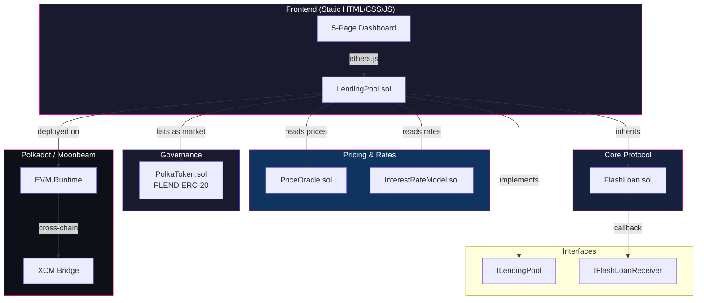
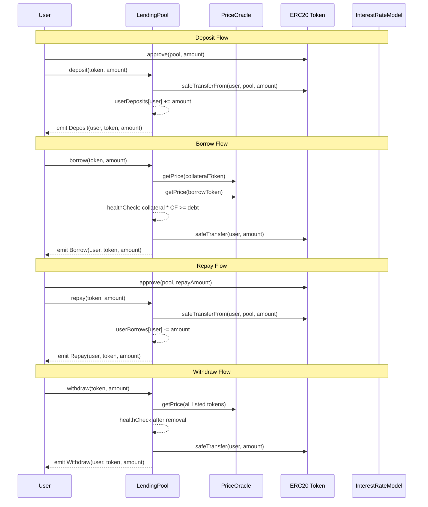
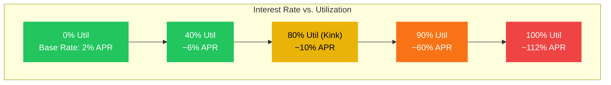

<div align="center">
  <h1>🏦 PolkaLend</h1>
  <p><strong>Flash loans + liquidation-proof micro-lending, live on Moonbeam</strong></p>
  <p>
    <a href="#features">Features</a> •
    <a href="#demo">Demo</a> •
    <a href="#architecture">Architecture</a> •
    <a href="#quick-start">Quick Start</a> •
    <a href="#tech-stack">Tech Stack</a>
  </p>
  
  <br/><br/>
  <p>
    
    
    
    
    
    
  </p>
  <p><em>Built for the <a href="https://polkadothackathon.com/">Polkadot Solidity Hackathon 2026</a></em></p>
</div>

---

## Features

- **⚡ Flash Loans** — Uncollateralized single-transaction loans with a 0.09% fee. Borrow any amount of pooled liquidity, use it for arbitrage or liquidations, and repay within the same transaction. If repayment fails, everything reverts atomically.

- **🏗️ Over-Collateralized Lending** — Deposit ERC-20 tokens as collateral and borrow against them with configurable collateral factors (up to 75%). Health factor checks on every borrow and withdrawal protect depositors from insolvency.

- **🔥 Liquidation Engine** — When a borrower's health factor drops below 1.0, anyone can liquidate up to 50% of their debt and claim the underlying collateral plus a 5% bonus. This keeps the protocol solvent even during sharp price drops.

- **📈 Kinked Interest Rate Model** — Compound-style dynamic rates that respond to pool utilization. Gentle slope below the 80% kink keeps borrowing affordable; steep slope above the kink incentivizes repayment and discourages over-utilization.

- **🎛️ Interactive 5-Page Dashboard** — Full-featured frontend with five dedicated pages: Dashboard overview, Lending (deposit/withdraw), Borrowing (borrow/repay with health factor gauge), Flash Loans (animated lifecycle visualization), and Analytics (interactive rate curves with parameter sliders).

- **🛡️ Battle-Tested Security** — ReentrancyGuard on every state-changing function, SafeERC20 for all token transfers, checks-effects-interactions pattern throughout, and health factor validation after every position change.

- **🪙 PLEND Governance Token** — ERC-20 token with a 100M hard cap and owner-controlled minting. Designed for fee discounts, governance voting, and liquidity mining rewards.

- **🌐 Moonbeam Native** — Deployed on Polkadot's Moonbeam parachain for full EVM compatibility with access to Polkadot's shared security, low transaction fees, and cross-chain interoperability via XCM.

---

## Demo

<table>
  <tr>
    <td align="center" width="50%">
      <br/>
      <strong>Dashboard Overview</strong><br/>
      <em>TVL, markets, interest rate chart, and activity feed</em>
    </td>
    <td align="center" width="50%">
      <br/>
      <strong>Lending</strong><br/>
      <em>Deposit/withdraw forms, health factor gauge, position summary</em>
    </td>
  </tr>
  <tr>
    <td align="center" width="50%">
      <br/>
      <strong>Flash Loans</strong><br/>
      <em>Animated lifecycle flow, fee calculator, loan history</em>
    </td>
    <td align="center" width="50%">
      <br/>
      <strong>Analytics</strong><br/>
      <em>TVL charts, utilization bars, interactive rate curve tuning</em>
    </td>
  </tr>
</table>

---

## Architecture



### Contract Relationships

| Contract | Inherits | Uses | Deployed By |
|----------|----------|------|-------------|
| **LendingPool** | FlashLoan, ILendingPool, Ownable, ReentrancyGuard | PriceOracle, InterestRateModel, SafeERC20 | `deploy.js` |
| **FlashLoan** | (abstract) | SafeERC20, IFlashLoanReceiver | Inherited by LendingPool |
| **InterestRateModel** | — | — | `deploy.js` |
| **PriceOracle** | Ownable | — | `deploy.js` |
| **PolkaToken** | ERC20, Ownable | — | `deploy.js` |

---

## User Flows



---

## Interest Rate Model

The protocol uses a **kinked (piecewise-linear) rate model** inspired by Compound and Aave. The kink creates a natural equilibrium: borrowing is cheap when utilization is healthy, but becomes prohibitively expensive as utilization approaches 100%.



**Rate Formulas:**

| Region | Formula |
|--------|---------|
| Below kink (U <= 80%) | `borrowRate = baseRate + U * slope1` |
| Above kink (U > 80%) | `borrowRate = baseRate + kink * slope1 + (U - kink) * slope2` |
| Supply rate | `supplyRate = borrowRate * U * (1 - reserveFactor)` |

**Default Parameters:**

| Parameter | Value | Description |
|-----------|-------|-------------|
| Base Rate | ~2% APR (634195839 per-sec) | Minimum borrow cost at 0% utilization |
| Slope 1 | ~10% APR (3170979198 per-sec) | Gentle rate increase below the kink |
| Slope 2 | ~100% APR (31709791983 per-sec) | Steep rate increase above the kink |
| Kink (Optimal Utilization) | 80% (0.8e18) | Target utilization equilibrium point |
| Reserve Factor | 10% | Protocol's share of interest income |
| Collateral Factor | 75% | Maximum borrow power per dollar of collateral |
| Liquidation Bonus | 5% | Incentive for liquidators |
| Flash Loan Fee | 0.09% (9 BPS) | Fee on flash-loaned amount |

---

## Quick Start

### Prerequisites

| Requirement | Version |
|-------------|---------|
| Node.js | >= 18 |
| npm or bun | Latest |
| Git | Any |

### Install, Compile, Test

```bash
# Clone the repository
git clone https://github.com/your-username/polkalend.git
cd polkalend

# Install dependencies
npm install

# Compile contracts
npx hardhat compile

# Run the full test suite (12 tests)
npx hardhat test

# Open the frontend
open frontend/index.html
# or serve it locally:
cd frontend && python3 -m http.server 3000
```

### Using Make

```bash
make install       # npm install
make compile       # npx hardhat compile
make test          # npx hardhat test
make dev           # Start Hardhat node + serve frontend on :3000
make clean         # Remove artifacts and cache
make help          # Show all available targets
```

---

## Deployment

### Local (Hardhat Node)

```bash
# Terminal 1: Start local blockchain
npx hardhat node

# Terminal 2: Deploy contracts
npx hardhat run scripts/deploy.js --network localhost
# or: make deploy-local
```

### Moonbase Alpha (Testnet)

1. Get testnet DEV tokens from the [Moonbase Alpha Faucet](https://faucet.moonbeam.network/)
2. Set your private key:
   ```bash
   export PRIVATE_KEY=0xYourPrivateKeyHere
   ```
3. Deploy:
   ```bash
   npx hardhat run scripts/deploy.js --network moonbase
   # or: make deploy-testnet
   ```
4. Verify (optional):
   ```bash
   npx hardhat verify --network moonbase <CONTRACT_ADDRESS> <CONSTRUCTOR_ARGS>
   ```

### Moonbeam (Mainnet)

```bash
export PRIVATE_KEY=0xYourPrivateKeyHere
npx hardhat run scripts/deploy.js --network moonbeam
# or: make deploy-mainnet
```

> Moonbeam mainnet uses GLMR for gas. Ensure your deployer wallet is funded before deploying.

### Deployment Order

The deploy script deploys contracts in dependency order:

1. **PolkaToken** — PLEND governance token (10M initial mint to deployer)
2. **InterestRateModel** — Kinked rate model with default parameters
3. **PriceOracle** — Owner-managed price feed (set PLEND price to $1)
4. **LendingPool** — Core pool referencing IRM + Oracle, then lists PLEND market (75% CF, 10% RF)

---

## Docker

```bash
# Build the multi-stage image
docker compose build

# Run (exposes Hardhat node on :8545, frontend on :3000)
docker compose up -d

# Stop
docker compose down
```

The Dockerfile uses a two-stage build: an Alpine-based builder compiles contracts, and a minimal runtime image runs a non-root `polkalend` user with a health check on the Hardhat node.

---

## Tech Stack

| Technology | Version | Purpose |
|------------|---------|---------|
| Solidity | 0.8.20 | Smart contract language with built-in overflow protection |
| Hardhat | 2.22+ | Compilation, testing, deployment, and local blockchain |
| OpenZeppelin Contracts | 5.x | ERC20, SafeERC20, Ownable, ReentrancyGuard |
| ethers.js | 6.x | Ethereum library for contract interaction |
| Chai | (via Hardhat Toolbox) | Assertion library for contract tests |
| HTML/CSS/JS | Vanilla | Zero-dependency 5-page interactive frontend |
| Canvas API | Native | Charts and visualizations without external libraries |
| Docker | Multi-stage Alpine | Containerized deployment |
| Moonbeam | Chain 1284 | Polkadot EVM-compatible parachain |
| Moonbase Alpha | Chain 1287 | Moonbeam testnet |

---

## Project Structure

```
polkalend/
├── contracts/
│   ├── LendingPool.sol              # Core: deposit, withdraw, borrow, repay, liquidate, flash loans
│   ├── FlashLoan.sol                # Abstract mixin: flash loan execution with 0.09% fee
│   ├── InterestRateModel.sol        # Kinked rate model: base + slope1/slope2 around 80% kink
│   ├── PriceOracle.sol              # Owner-managed USD price feeds (placeholder for Chainlink)
│   ├── PolkaToken.sol               # PLEND ERC-20 governance token, 100M max supply
│   ├── interfaces/
│   │   ├── ILendingPool.sol         # Pool interface with events and core function signatures
│   │   └── IFlashLoanReceiver.sol   # Callback interface for flash loan receivers
│   └── mocks/
│       └── MockFlashLoanReceiver.sol # Test helper that auto-repays flash loans
├── scripts/
│   └── deploy.js                    # Deployment: Token → IRM → Oracle → Pool → list market
├── test/
│   └── LendingPool.test.js          # 12 tests covering all protocol operations
├── frontend/
│   ├── index.html                   # 5-page SPA: Dashboard, Lending, Borrowing, Flash Loans, Analytics
│   ├── styles.css                   # Design system: dark theme, Polkadot pink accents, responsive
│   └── app.js                       # Router, charts, forms, animations, demo data
├── screenshots/
│   └── hero.png                     # Dashboard screenshot
├── hardhat.config.js                # Solidity 0.8.20, optimizer 200 runs, Moonbeam networks
├── package.json                     # Dependencies: Hardhat, OpenZeppelin, ethers.js
├── Dockerfile                       # Multi-stage: builder compiles, runtime runs non-root
├── docker-compose.yml               # Single service: app on ports 8545 + 3000
├── Makefile                         # Targets: install, compile, test, deploy-*, docker-*, dev
├── .env.example                     # Environment template (private key, RPC, API keys)
├── .gitignore                       # Excludes node_modules, artifacts, cache, .env
└── LICENSE                          # MIT
```

---

## Testing

### Run Tests

```bash
npx hardhat test
# or: make test
```

### Test Suite (12 Tests)

| # | Test | Category | Validates |
|---|------|----------|-----------|
| 1 | Deposits and balance tracking | Core | `deposit()` updates userDeposits and totalDeposits |
| 2 | Withdrawals | Core | `withdraw()` decrements balances and transfers tokens |
| 3 | Borrowing against collateral | Core | `borrow()` succeeds when within collateral factor |
| 4 | Rejection of over-leveraged borrows | Safety | Revert when borrow exceeds 75% CF limit |
| 5 | Loan repayment | Core | `repay()` reduces debt; partial repayment caps at owed |
| 6 | Collateral/borrow value calculations | Views | `getCollateralValue()` and `getBorrowValue()` return correct USD values |
| 7 | Prevention of undercollateralized withdrawals | Safety | Revert when withdrawal would break health factor |
| 8 | Flash loan execution and fee collection | Flash Loans | Pool balance increases by fee after flash loan |
| 9 | Interest rate model (base, mid, high) | Rates | `getBorrowRate()` increases with utilization, jumps at kink |
| 10 | Liquidation of unhealthy positions | Liquidation | Price drop triggers liquidation; debt reduced, collateral seized with 5% bonus |
| 11 | Rejection of unlisted token operations | Safety | Revert on deposit of non-listed token address |
| 12 | Event emission verification | Events | `Deposit` event emitted with correct args |

---

## Security

### On-Chain Protections

| Protection | Implementation | Contracts |
|------------|---------------|-----------|
| **Reentrancy Guard** | OpenZeppelin `ReentrancyGuard` with `nonReentrant` modifier | LendingPool (all 6 public functions) |
| **Safe Token Transfers** | OpenZeppelin `SafeERC20` wrapping all `transfer`/`transferFrom` calls | LendingPool, FlashLoan |
| **Health Factor Checks** | `_isHealthy()` validated after every `borrow()` and `withdraw()` | LendingPool |
| **Liquidation Caps** | Maximum 50% of outstanding debt per liquidation call | LendingPool |
| **Flash Loan Invariant** | `balanceAfter >= balanceBefore + fee` enforced atomically | FlashLoan |
| **Overflow Protection** | Solidity 0.8.20 built-in checks; no `unchecked` blocks used | All contracts |
| **Access Control** | OpenZeppelin `Ownable` for admin functions (market listing, price updates) | LendingPool, PriceOracle, PolkaToken |
| **Supply Cap** | `MAX_SUPPLY = 100M` enforced on every `mint()` call | PolkaToken |
| **Checks-Effects-Interactions** | State updated before external calls in `withdraw()` and `borrow()` | LendingPool |

### Security Audit Summary

An internal audit found **0 critical** and **0 high-severity** exploitable vulnerabilities. Known design limitations (documented, not in hackathon scope):

- PriceOracle is owner-managed — production would use Chainlink/DIA feeds with staleness checks
- Interest accrual is modeled but not yet applied to borrow balances on-chain
- No `Pausable` circuit breaker (would be added for production deployment)

---

## Environment Variables

Copy `.env.example` to `.env` and fill in your values:

| Variable | Required | Description |
|----------|----------|-------------|
| `PRIVATE_KEY` | Yes (for deployment) | Deployer wallet private key with `0x` prefix |
| `MOONBEAM_RPC` | No | Override Moonbeam mainnet RPC (default: `https://rpc.api.moonbeam.network`) |
| `MOONBASE_RPC` | No | Override Moonbase Alpha RPC (default: `https://rpc.api.moonbase.moonbeam.network`) |
| `ETHERSCAN_API_KEY` | No | Block explorer API key for contract verification |
| `MOONSCAN_API_KEY` | No | Moonscan API key (alternative to Etherscan for Moonbeam) |
| `REPORT_GAS` | No | Set `true` to generate gas usage reports during tests |
| `COINMARKETCAP_API_KEY` | No | CoinMarketCap API key for USD gas cost estimation |

---

## Smart Contract API

### LendingPool

| Function | Access | Description |
|----------|--------|-------------|
| `deposit(token, amount)` | Public | Deposit ERC-20 tokens as collateral. Requires prior `approve()`. |
| `withdraw(token, amount)` | Public | Withdraw deposited tokens. Reverts if position becomes undercollateralized. |
| `borrow(token, amount)` | Public | Borrow tokens against deposited collateral. Health check enforced. |
| `repay(token, amount)` | Public | Repay borrowed tokens. Caps at outstanding debt if overpaying. |
| `liquidate(borrower, debtToken, collateralToken, amount)` | Public | Liquidate an unhealthy position. Max 50% of debt, 5% bonus to liquidator. |
| `flashLoan(receiver, token, amount, data)` | Public | Execute a flash loan. Receiver must implement `IFlashLoanReceiver`. |
| `addMarket(token, collateralFactor, reserveFactor)` | Owner | List a new token market with specified CF and RF. |
| `getCollateralValue(user)` | View | Total USD collateral value (adjusted by collateral factors). |
| `getBorrowValue(user)` | View | Total USD borrow value across all markets. |
| `isHealthy(user)` | View | Returns `true` if collateral value >= borrow value. |
| `getListedTokens()` | View | Returns array of all listed token addresses. |

### InterestRateModel

| Function | Access | Description |
|----------|--------|-------------|
| `getBorrowRate(totalDeposits, totalBorrows)` | View | Per-second borrow rate based on utilization and kink model. |
| `getSupplyRate(totalDeposits, totalBorrows, reserveFactor)` | View | Per-second supply rate after deducting protocol reserve. |

### PriceOracle

| Function | Access | Description |
|----------|--------|-------------|
| `setPrice(token, price)` | Owner | Set USD price for a single token (18 decimals, 1e18 = $1). |
| `setPrices(tokens[], prices[])` | Owner | Batch-set prices for multiple tokens. |
| `getPrice(token)` | View | Get USD price. Reverts if price not set. |

### PolkaToken

| Function | Access | Description |
|----------|--------|-------------|
| `mint(to, amount)` | Owner | Mint new PLEND tokens. Reverts if total supply exceeds 100M cap. |

---

## Contributing

1. Fork the repository
2. Create a feature branch: `git checkout -b feature/my-feature`
3. Write tests for new functionality
4. Ensure all tests pass: `npx hardhat test`
5. Commit with conventional commits: `feat(pool): add market removal`
6. Open a pull request against `main`

### Code Standards

- Solidity: follow OpenZeppelin patterns, NatSpec on all public functions
- JavaScript: ES6+, `const`/`let` only, descriptive variable names
- Frontend: no frameworks, no build tools, vanilla HTML/CSS/JS
- Tests: one test per behavior, descriptive names, test both success and revert cases

---

## License

[MIT](./LICENSE) — free for commercial and non-commercial use.

---

<div align="center">
  <p>
    <strong>PolkaLend</strong> — Decentralized Micro-Lending on Polkadot<br/>
    Built with Solidity, Hardhat, and OpenZeppelin for the Polkadot Hackathon 2026
  </p>
  <p>
    <a href="https://moonbeam.network/">Moonbeam</a> •
    <a href="https://polkadot.network/">Polkadot</a> •
    <a href="https://openzeppelin.com/contracts/">OpenZeppelin</a>
  </p>
</div>
