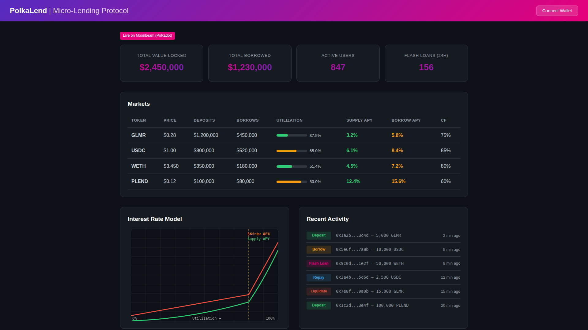
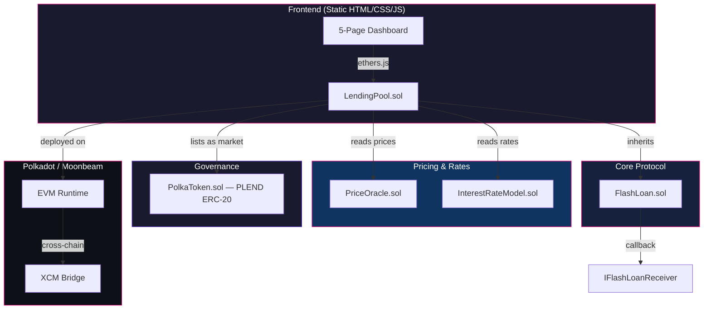
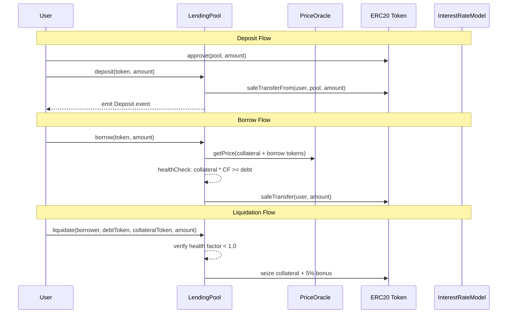
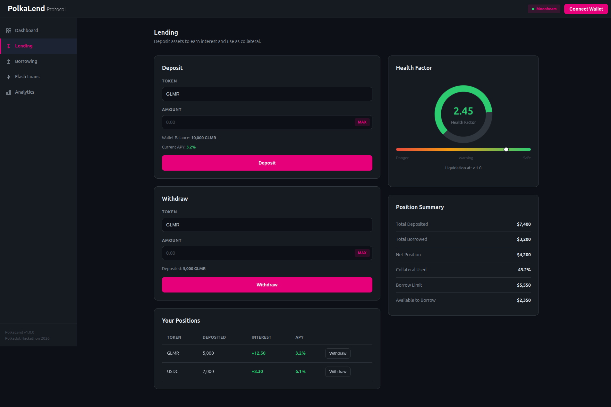
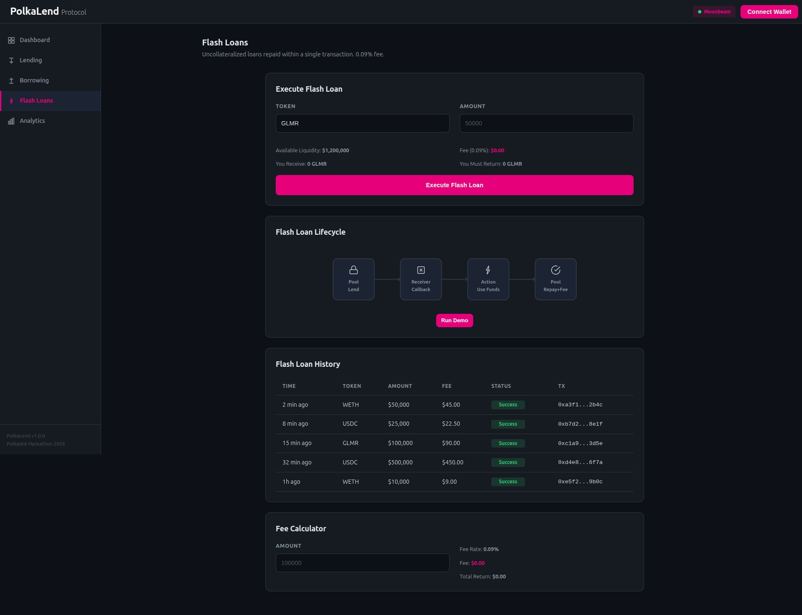
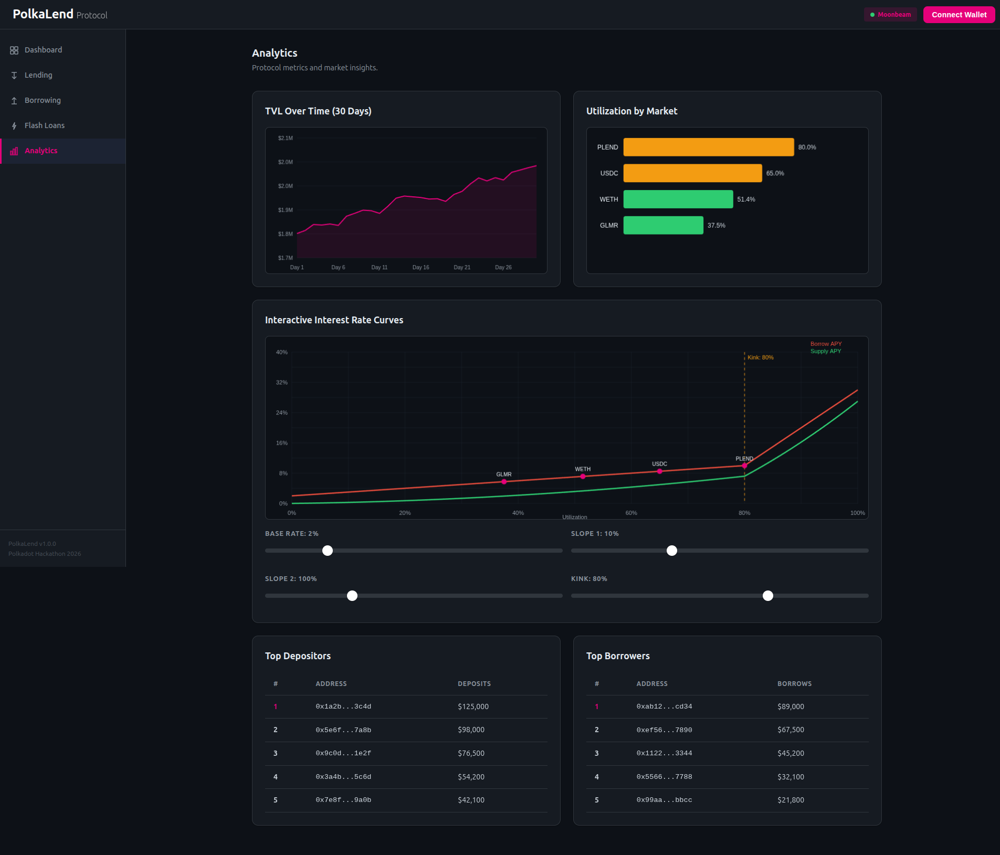

<div align="center">

# PolkaLend

**Flash loans + liquidation-proof micro-lending on Polkadot's Moonbeam**



<br/>


*Built for the [Polkadot Solidity Hackathon 2026](https://polkadothackathon.com/)*

</div>

---

## Architecture



### User Flows



---

## Features

- **Flash Loans** — Uncollateralized single-transaction loans with 0.09% fee. Borrow any amount, use for arbitrage or liquidations, repay atomically.
- **Over-Collateralized Lending** — Deposit ERC-20 tokens as collateral and borrow against them (up to 75% CF). Health factor checks on every operation.
- **Liquidation Engine** — When health factor drops below 1.0, liquidators can seize up to 50% of debt with a 5% collateral bonus.
- **Kinked Interest Rate Model** — Compound-style dynamic rates. Gentle slope below 80% utilization, steep slope above.
- **5-Page Interactive Dashboard** — Dashboard, Lending, Borrowing, Flash Loans, and Analytics with interactive rate curve sliders.
- **PLEND Governance Token** — ERC-20 with 100M hard cap. Designed for fee discounts, governance, and liquidity mining.
- **Moonbeam Native** — Full EVM compatibility on Polkadot with shared security and cross-chain interoperability via XCM.

---

## Screenshots

| Lending | Flash Loans | Analytics |
|:-------:|:-----------:|:---------:|
|  |  |  |

---

## Interest Rate Model

```
Below kink (U <= 80%):  borrowRate = baseRate + U * slope1
Above kink (U > 80%):   borrowRate = baseRate + kink * slope1 + (U - kink) * slope2
Supply rate:             supplyRate = borrowRate * U * (1 - reserveFactor)
```

| Parameter | Value |
|-----------|-------|
| Base Rate | ~2% APR |
| Slope 1 | ~10% APR |
| Slope 2 | ~100% APR |
| Kink (Optimal Utilization) | 80% |
| Reserve Factor | 10% |
| Collateral Factor | 75% |
| Liquidation Bonus | 5% |
| Flash Loan Fee | 0.09% |

---

## Quick Start

```bash
git clone https://github.com/Akasxh/polkalend.git
cd polkalend

npm install
npx hardhat compile
npx hardhat test            # 12 tests covering all protocol operations

# Open the frontend
open frontend/index.html
```

### Using Make

```bash
make install       # npm install
make compile       # npx hardhat compile
make test          # npx hardhat test
make dev           # Start Hardhat node + serve frontend on :3000
make clean         # Remove artifacts and cache
```

### Deployment

```bash
# Local
npx hardhat node &
npx hardhat run scripts/deploy.js --network localhost

# Moonbase Alpha (testnet)
export PRIVATE_KEY=0xYourPrivateKeyHere
npx hardhat run scripts/deploy.js --network moonbase

# Moonbeam (mainnet)
npx hardhat run scripts/deploy.js --network moonbeam
```

### Docker

```bash
docker compose build
docker compose up -d        # Hardhat node on :8545, frontend on :3000
```

---

## Project Structure

```
polkalend/
├── contracts/
│   ├── LendingPool.sol              # Core: deposit, withdraw, borrow, repay, liquidate, flash loans
│   ├── FlashLoan.sol                # Abstract mixin: flash loan execution with 0.09% fee
│   ├── InterestRateModel.sol        # Kinked rate model: base + slope1/slope2 around 80% kink
│   ├── PriceOracle.sol              # Owner-managed USD price feeds
│   ├── PolkaToken.sol               # PLEND ERC-20 governance token, 100M max supply
│   ├── interfaces/
│   │   ├── ILendingPool.sol
│   │   └── IFlashLoanReceiver.sol
│   └── mocks/
│       └── MockFlashLoanReceiver.sol
├── scripts/
│   └── deploy.js                    # Token -> IRM -> Oracle -> Pool -> list market
├── test/
│   ├── LendingPool.test.js          # 12 tests
│   └── EdgeCases.test.js
├── frontend/
│   ├── index.html                   # 5-page SPA with hash-based routing
│   ├── styles.css                   # Dark theme, Polkadot pink accents
│   └── app.js                       # Router, charts, forms, demo data
├── hardhat.config.js
├── Dockerfile                       # Multi-stage Alpine build
├── docker-compose.yml
├── Makefile
├── .env.example
└── package.json
```

---

## Tech Stack

| Technology | Purpose |
|------------|---------|
| Solidity 0.8.20 | Smart contracts with built-in overflow protection |
| Hardhat 2.22+ | Compilation, testing, deployment, local blockchain |
| OpenZeppelin 5.x | ERC20, SafeERC20, Ownable, ReentrancyGuard |
| ethers.js 6.x | Contract interaction |
| Vanilla HTML/CSS/JS | Zero-dependency 5-page frontend with Canvas API charts |
| Docker | Multi-stage Alpine containerization |
| Moonbeam (Chain 1284) | Polkadot EVM-compatible parachain |

---

## Testing

```bash
npx hardhat test
```

12 tests covering: deposits, withdrawals, borrowing, over-leverage rejection, repayment, collateral calculations, undercollateralized withdrawal prevention, flash loan execution, interest rate model, liquidation, unlisted token rejection, and event emission.

---

## Security

| Protection | Implementation |
|------------|---------------|
| Reentrancy Guard | `nonReentrant` on all 6 public LendingPool functions |
| Safe Transfers | `SafeERC20` wrapping all token operations |
| Health Factor Checks | Validated after every `borrow()` and `withdraw()` |
| Liquidation Caps | Max 50% of outstanding debt per call |
| Flash Loan Invariant | `balanceAfter >= balanceBefore + fee` enforced atomically |
| Overflow Protection | Solidity 0.8.20 built-in checks, no `unchecked` blocks |
| Supply Cap | `MAX_SUPPLY = 100M` on every `mint()` |

---

## Contributing

1. Fork the repository
2. Create a feature branch: `git checkout -b feature/my-feature`
3. Write tests for new functionality
4. Ensure all tests pass: `npx hardhat test`
5. Commit with conventional commits: `feat(pool): add market removal`
6. Open a pull request against `main`

---

## License

[MIT](./LICENSE)

---

<div align="center">
  <strong>PolkaLend</strong> — Decentralized Micro-Lending on Polkadot
  <br/>
  <a href="https://moonbeam.network/">Moonbeam</a> · <a href="https://polkadot.network/">Polkadot</a> · <a href="https://openzeppelin.com/contracts/">OpenZeppelin</a>
</div>
