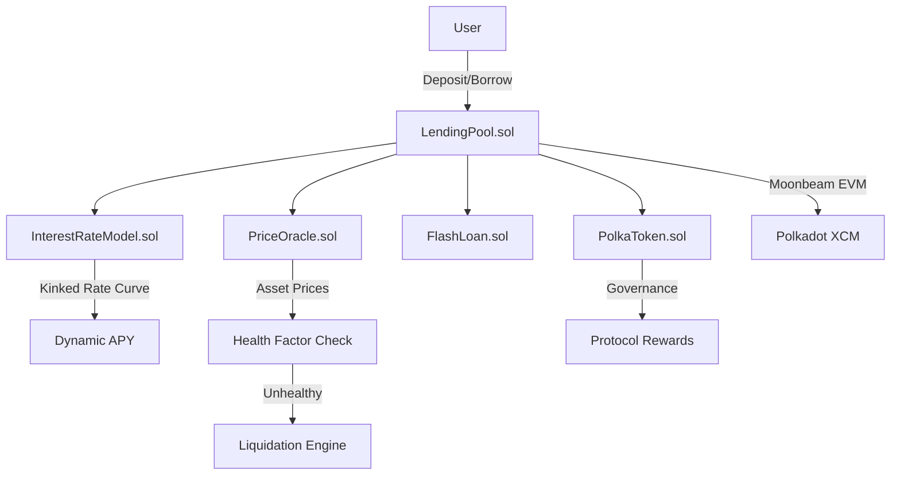

# PolkaLend -- Decentralized Micro-Lending Protocol

> A DeFi micro-lending protocol built with Solidity for Polkadot's EVM-compatible chains (Moonbeam). Features flash loans, collateralized lending, liquidations, and a dynamic interest rate model.

**Built for the [Polkadot Solidity Hackathon 2026](https://polkadothackathon.com/)**

---

## Why Polkadot?

Traditional DeFi protocols are siloed on single chains. Polkadot changes this fundamentally:

### Cross-Chain Interoperability via XCM

Polkadot's Cross-Consensus Messaging (XCM) enables **native cross-chain communication** without relying on vulnerable third-party bridges. PolkaLend can:

- **Bridge collateral** from any parachain -- Acala (stablecoins), Astar (dApps), Phala (privacy), Hydration (liquidity) -- via XCM messages
- **Access unified liquidity** across the entire Polkadot ecosystem, eliminating the fragmentation problem that plagues multi-chain DeFi
- **Compose with other DeFi protocols** across parachains: use Acala's aUSD as collateral, borrow against Hydration LP positions, or trigger PolkaLend liquidations from any connected chain

### Moonbeam: Full EVM on Polkadot

Moonbeam provides a complete Ethereum-compatible environment within Polkadot:

- **Drop-in Solidity support**: battle-tested patterns (OpenZeppelin, Compound-style markets) work without modification
- **Familiar tooling**: Hardhat, ethers.js, MetaMask -- zero learning curve for Ethereum developers
- **Cross-chain by default**: Moonbeam's precompiles expose XCM to Solidity contracts, enabling cross-chain calls directly from smart contracts

### Shared Security & Scalability

- **Shared security model**: All parachains inherit security from Polkadot's relay chain validators, eliminating the "bootstrap your own security" problem
- **Parallel processing**: Parachains process transactions in parallel, enabling higher throughput than single-chain architectures -- critical for a lending protocol handling concurrent deposits, borrows, and liquidations
- **Low fees**: Transaction costs on Moonbeam are a fraction of Ethereum mainnet, making micro-lending economically viable

---

## Architecture



### Contract Architecture

```
                          +-----------------------+
                          |      Frontend (UI)    |
                          |   HTML/JS Dashboard   |
                          +-----------+-----------+
                                      |
                                      | ethers.js / Web3
                                      v
+------------------+    +----------------------------+    +------------------+
|   PriceOracle    |<---|       LendingPool          |--->| InterestRate     |
|                  |    |                            |    | Model            |
|  setPrice()      |    |  deposit()    withdraw()   |    |                  |
|  getPrice()      |    |  borrow()     repay()      |    | getBorrowRate()  |
|                  |    |  liquidate()  flashLoan()  |    | getSupplyRate()  |
+------------------+    +----------------------------+    +------------------+
                                      |
                                      | inherits
                                      v
                          +-----------------------+
                          |      FlashLoan        |
                          |  _executeFlashLoan()  |
                          +-----------+-----------+
                                      |
                                      | callback
                                      v
                          +-----------------------+
                          | IFlashLoanReceiver    |
                          |  executeOperation()   |
                          +-----------------------+

+------------------+
|   PolkaToken     |
|   (ERC-20)       |
|                  |
|  PLEND governance|
|  token, 100M cap |
+------------------+
```

### Protocol Components

| Contract | Role | Key Functions |
|----------|------|---------------|
| **LendingPool** | Core lending logic | `deposit()`, `withdraw()`, `borrow()`, `repay()`, `liquidate()`, `flashLoan()` |
| **FlashLoan** | Uncollateralized single-tx loans | `_executeFlashLoan()` with 0.09% fee |
| **InterestRateModel** | Dynamic kinked rate model | `getBorrowRate()`, `getSupplyRate()` |
| **PriceOracle** | Asset price feeds | `setPrice()`, `getPrice()` (owner-managed; swap for Chainlink/DIA in prod) |
| **PolkaToken** | PLEND governance token | ERC-20 with 100M max supply, owner-only minting |

---

## How It Works

### User Flow: Lending

```
Lender                          LendingPool                    Token
  |-- approve(pool, amount) ------>|                              |
  |-- deposit(token, amount) ----->|-- transferFrom(lender) ----->|
  |                                |   userDeposits[lender] += amt|
  |                                |   totalDeposits += amt       |
  |                                |   emit Deposit(...)          |
  |                                |                              |
  |   ... time passes, interest accrues ...                       |
  |                                |                              |
  |-- withdraw(token, amount) ---->|   health check passes        |
  |<--- transfer(lender, amount) --|<-----------------------------|
```

### User Flow: Borrowing

```
Borrower                        LendingPool                    Oracle
  |-- deposit(collateral) ------->|                              |
  |-- borrow(token, amount) ----->|-- getPrice(collateral) ----->|
  |                                |-- getPrice(borrow token) -->|
  |                                |   check: collateralValue    |
  |                                |          * CF >= borrowValue|
  |<--- transfer(borrower, amt) --|                              |
  |                                |                              |
  |   ... borrower uses funds ...                                 |
  |                                |                              |
  |-- repay(token, amount) ------>|-- transferFrom(borrower) --->|
  |                                |   userBorrows -= repayAmt   |
```

### User Flow: Flash Loan

```
Contract (Receiver)             LendingPool
  |-- flashLoan(receiver, token, amount, data) -->|
  |                                                |   check balance >= amount
  |<--- transfer(receiver, amount) ---------------|
  |                                                |
  |   executeOperation(token, amount, fee, data)   |
  |   ... arbitrage / liquidation / swap ...       |
  |                                                |
  |-- approve + repay (amount + fee) ------------>|
  |                                                |   verify balance >= before + fee
  |                                                |   emit FlashLoan(...)
```

### User Flow: Liquidation

```
Liquidator                      LendingPool                    Oracle
  |                                |-- isHealthy(borrower)? ----->|
  |                                |   collateralValue < borrowVal|
  |-- liquidate(borrower, debt,    |                              |
  |    collateral, repayAmt) ----->|   check repayAmt <= 50% debt|
  |                                |-- transferFrom(liquidator) ->|
  |                                |   borrower debt -= repayAmt  |
  |                                |   seize = repayAmt * 1.05    |
  |<--- transfer(collateral) -----|   (5% liquidation bonus)     |
```

---

## Interest Rate Model

Uses a **kinked rate model** (similar to Compound/Aave):

- Below optimal utilization (80%): rates increase linearly with slope1
- Above optimal utilization: rates increase sharply with slope2
- This incentivizes utilization to stay near the optimal point

```
Rate
  ^
  |                      /
  |                     / <- slope2 (steep)
  |                    /
  |              -----+ <- kink (80%)
  |            /
  |          / <- slope1 (gentle)
  |        /
  |------/
  +-------------------------> Utilization
  0%    20%   40%   60%   80%  100%
```

| Parameter | Value | Description |
|-----------|-------|-------------|
| Base rate | ~2% APR | Minimum borrow cost at 0% utilization |
| Slope 1 | ~10% APR | Rate increase per unit utilization below kink |
| Slope 2 | ~100% APR | Rate increase per unit utilization above kink |
| Kink | 80% | Optimal utilization target |
| Reserve factor | 10% | Protocol's share of interest income |

---

## Contract Addresses

| Contract | Address | Network |
|----------|---------|---------|
| PolkaToken | `TBD` | Moonbeam |
| InterestRateModel | `TBD` | Moonbeam |
| PriceOracle | `TBD` | Moonbeam |
| LendingPool | `TBD` | Moonbeam |

---

## Getting Started

### Prerequisites

- Node.js >= 18
- Bun (optional, for faster installs)

### Install

```bash
bun install
# or: npm install
```

### Compile

```bash
npx hardhat compile
```

### Test

```bash
npx hardhat test
```

### Deploy (Local)

```bash
npx hardhat node &
npx hardhat run scripts/deploy.js --network localhost
```

### Deploy to Moonbase Alpha (Testnet)

1. **Get testnet DEV tokens** from the [Moonbase Alpha Faucet](https://faucet.moonbeam.network/)

2. **Export your private key** (never commit this):
   ```bash
   export PRIVATE_KEY=0xYourPrivateKeyHere
   ```

3. **Deploy**:
   ```bash
   npx hardhat run scripts/deploy.js --network moonbase
   ```

4. **Verify contracts** (optional):
   ```bash
   npx hardhat verify --network moonbase <CONTRACT_ADDRESS> <CONSTRUCTOR_ARGS>
   ```

### Deploy to Moonbeam (Mainnet)

```bash
export PRIVATE_KEY=0xYourPrivateKeyHere
npx hardhat run scripts/deploy.js --network moonbeam
```

> **Note**: Moonbeam mainnet uses GLMR for gas. Ensure your deployer wallet is funded.

### Frontend

Open `frontend/index.html` in a browser. It's a static demo dashboard showing protocol stats, market data, interest rate curves, and recent activity. In production, it connects to deployed contracts on Moonbeam via ethers.js.

---

## Project Structure

```
p6-polkadot-defi/
  hardhat.config.js          # Hardhat config with Moonbeam networks
  package.json
  README.md
  contracts/
    LendingPool.sol           # Core lending pool (deposit/borrow/repay/withdraw/liquidate)
    InterestRateModel.sol     # Dynamic kinked interest rate model
    PriceOracle.sol           # Simple price oracle (owner-set prices)
    FlashLoan.sol             # Flash loan mixin
    PolkaToken.sol            # PLEND ERC-20 governance token
    interfaces/
      ILendingPool.sol        # Lending pool interface
      IFlashLoanReceiver.sol  # Flash loan callback interface
    mocks/
      MockFlashLoanReceiver.sol  # Test helper for flash loans
  scripts/
    deploy.js                 # Deployment script
  test/
    LendingPool.test.js       # 12 tests covering all core flows
  frontend/
    index.html                # Dashboard UI
    app.js                    # Dashboard logic (demo data)
```

---

## Test Coverage

12 tests covering all core protocol operations:

| # | Test | Category |
|---|------|----------|
| 1 | Deposits and balance tracking | Core |
| 2 | Withdrawals | Core |
| 3 | Borrowing against collateral | Core |
| 4 | Rejection of over-leveraged borrows | Safety |
| 5 | Loan repayment | Core |
| 6 | Collateral/borrow value calculations | View |
| 7 | Prevention of undercollateralized withdrawals | Safety |
| 8 | Flash loan execution and fee collection | Flash Loans |
| 9 | Interest rate model (base, mid, high utilization) | Interest |
| 10 | Liquidation of unhealthy positions | Liquidation |
| 11 | Rejection of unlisted token operations | Safety |
| 12 | Event emission verification | Events |

---

## Security Considerations

- **ReentrancyGuard** on all state-modifying functions (deposit, withdraw, borrow, repay, liquidate, flashLoan)
- **SafeERC20** for all token transfers (handles non-standard return values)
- **Health checks** after every borrow and withdraw to prevent undercollateralization
- **Liquidation caps**: maximum 50% of debt per liquidation call
- **Owner-only admin functions** for market listing and oracle price updates
- **Flash loan invariant**: balance after >= balance before + fee, enforced atomically

**Production hardening** (not in hackathon scope):
- Replace PriceOracle with Chainlink/DIA on-chain feeds
- Add time-weighted interest accrual
- Implement governance (timelock, multisig) for admin functions
- Formal audit of all contracts

---

## Tech Stack

- **Solidity 0.8.20** with optimizer (200 runs)
- **Hardhat** for compilation, testing, and deployment
- **OpenZeppelin Contracts** (ERC20, SafeERC20, Ownable, ReentrancyGuard)
- **Chai + Ethers.js** for testing
- **Moonbeam/Moonbase Alpha** for deployment targets

## License

MIT
